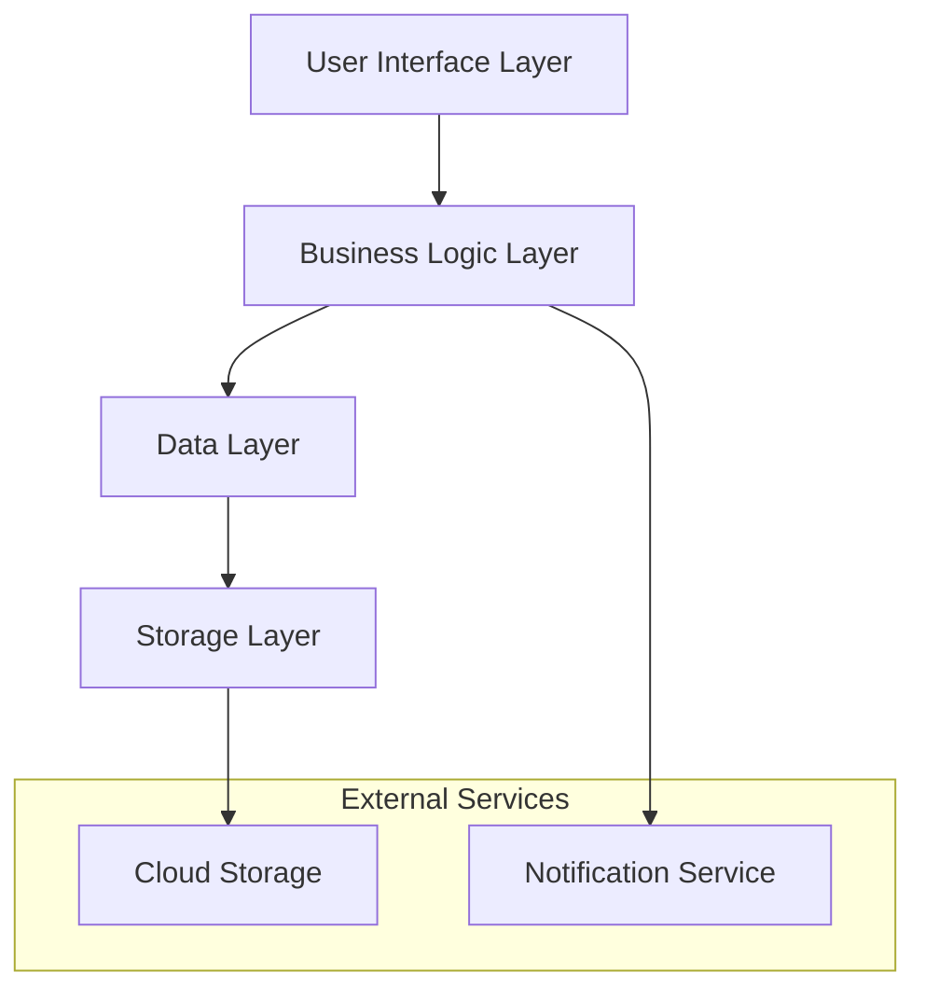

# Design Document: Recipe Manager Mobile Application

## Overview

The Recipe Manager is a cross-platform mobile application that enables users to create, manage, and share cooking recipes with integrated cooking assistance features. The application provides comprehensive recipe management, stage-specific photo documentation, social sharing capabilities, recipe modification tools, and cooking timers with notifications to guide users through recipe execution.

The system is designed as a mobile-first application with offline-first capabilities, ensuring users can access their recipes and cooking tools even without internet connectivity. The application will sync data to cloud storage when connectivity is available.

## Architecture

### High-Level Architecture

The application follows a layered architecture pattern with clear separation of concerns:



### Technology Stack

Based on modern mobile development best practices and cross-platform requirements:

- **Framework**: Kotlin Multiplatform Mobile (KMM) for shared business logic
- **UI Framework**: Compose Multiplatform for native UI experiences
- **Database**: SQLDelight with SQLite for type-safe database operations
- **Networking**: Ktor Client for HTTP operations and API calls
- **Serialization**: Kotlinx Serialization for JSON handling
- **Coroutines**: Kotlinx Coroutines for asynchronous operations
- **Date/Time**: Kotlinx DateTime for cross-platform date handling
- **Dependency Injection**: Manual DI with factory pattern
- **Testing**: Kotest for unit testing and property-based testing with expressive assertions, Cucumber Serenity for BDD feature testing
- **Logging**: Kermit for multiplatform logging
- **Cloud Storage**: Firebase SDK (platform-specific implementations)

## Components and Interfaces

### Core Components

#### 1. Domain Layer (Business Logic)
- **RecipeService**: Handles CRUD operations and business rules for recipes
- **ValidationService**: Validates recipe data integrity and completeness
- **SearchEngine**: Provides search functionality across recipes with relevance scoring

#### 2. Data Layer (Persistence & Sync)
- **RecipeRepository**: Manages local SQLite operations using SQLDelight
- **PhotoRepository**: Handles photo storage and cloud synchronization
- **SyncManager**: Orchestrates data synchronization between local and cloud storage

#### 3. Presentation Layer (UI)
- **RecipeViewModel**: Manages UI state and user interactions for recipe screens
- **PhotoViewModel**: Handles photo capture, display, and management UI state
- **TimerViewModel**: Coordinates cooking timers and notifications

#### 4. Platform Layer (Native Features)
- **DatabaseDriver**: Platform-specific SQLite driver implementations
- **PhotoCapture**: Native camera and gallery access
- **NotificationManager**: Platform-specific push notification handling
- **FileManager**: Native file system operations for photo storage

### Interface Definitions

#### Recipe Interface
```kotlin
@Serializable
data class Recipe(
    val id: String,
    val title: String,
    val description: String? = null,
    val ingredients: List<Ingredient>,
    val steps: List<CookingStep>,
    val preparationTime: Int, // in minutes
    val cookingTime: Int, // in minutes
    val servings: Int,
    val tags: List<String>,
    val createdAt: Instant,
    val updatedAt: Instant,
    val version: Int = 1,
    val parentRecipeId: String? = null // For recipe upgrades
)

@Serializable
data class Ingredient(
    val id: String,
    val name: String,
    val quantity: Double,
    val unit: String,
    val notes: String? = null,
    val photos: List<Photo> = emptyList()
)

@Serializable
data class CookingStep(
    val id: String,
    val stepNumber: Int,
    val instruction: String,
    val duration: Int? = null, // in minutes
    val temperature: Int? = null,
    val photos: List<Photo> = emptyList(),
    val timerRequired: Boolean = false
)
```

#### Photo Interface
```kotlin
@Serializable
data class Photo(
    val id: String,
    val localPath: String,
    val cloudUrl: String? = null,
    val caption: String? = null,
    val stage: PhotoStage,
    val timestamp: Instant,
    val syncStatus: SyncStatus = SyncStatus.LOCAL_ONLY
)

@Serializable
enum class PhotoStage {
    RAW_INGREDIENTS,
    PROCESSED_INGREDIENTS,
    COOKING_STEP,
    FINAL_RESULT
}

@Serializable
enum class SyncStatus {
    LOCAL_ONLY,
    SYNCING,
    SYNCED,
    SYNC_FAILED
}
```

#### Timer Interface
```kotlin
@Serializable
data class CookingTimer(
    val id: String,
    val recipeId: String,
    val stepId: String,
    val duration: Int, // in seconds
    val remainingTime: Int,
    val status: TimerStatus,
    val createdAt: Instant
)

@Serializable
enum class TimerStatus {
    READY,
    RUNNING,
    PAUSED,
    COMPLETED,
    CANCELLED
}
```

## Data Models

### Database Schema

The application uses SQLDelight for type-safe SQL operations with SQLite:

#### Core Tables
- **Recipe**: Primary storage for recipe metadata and content with versioning support
- **Ingredient**: Normalized ingredient data linked to recipes
- **CookingStep**: Individual cooking instructions with timing and temperature data
- **Photo**: Photo metadata with local paths and cloud sync status
- **Collection**: User-created recipe collections for organization
- **RecipeCollection**: Many-to-many relationship between recipes and collections
- **CookingTimer**: Active and historical cooking timers
- **SyncQueue**: Operations pending cloud synchronization for offline support

#### SQLDelight Integration
- Type-safe SQL queries generated at compile time
- Automatic mapping between SQL results and Kotlin data classes
- Support for complex queries with joins and aggregations
- Migration support for schema evolution

### Data Flow Patterns

#### Offline-First Pattern
1. All operations execute against local SQLite database first
2. Operations are queued for cloud synchronization
3. Sync occurs automatically when connectivity is available
4. Conflict resolution handles simultaneous edits

#### Photo Management Pattern
1. Photos are captured and stored locally immediately
2. Images are optimized for mobile storage
3. Cloud upload occurs in background with retry logic
4. Local photos remain accessible during sync failures

## Error Handling

### Error Categories and Strategies

#### 1. Network Connectivity Errors
- **Strategy**: Graceful degradation with offline-first approach
- **Implementation**: Queue operations for later sync, show connectivity status
- **User Experience**: Clear indicators of offline mode, no functionality loss

#### 2. Storage Errors
- **Strategy**: Robust error recovery with user notification
- **Implementation**: Automatic retry with exponential backoff, alternative storage paths
- **User Experience**: Clear error messages with suggested actions

#### 3. Photo Processing Errors
- **Strategy**: Fallback mechanisms with user choice
- **Implementation**: Multiple image formats support, compression alternatives
- **User Experience**: Option to retry or skip photo operations

#### 4. Timer and Notification Errors
- **Strategy**: Fail-safe with manual backup options
- **Implementation**: Multiple notification channels, visual timer fallbacks
- **User Experience**: Clear timer status, manual timer controls always available

#### 5. Data Synchronization Conflicts
- **Strategy**: User-controlled conflict resolution
- **Implementation**: Present both versions with merge options
- **User Experience**: Clear conflict presentation with recommended actions

### Error Recovery Mechanisms

- **Automatic Retry**: Network operations with exponential backoff
- **Data Validation**: Input validation at multiple layers
- **Graceful Degradation**: Core functionality available during partial failures
- **User Feedback**: Clear error messages with actionable next steps
- **Logging**: Comprehensive error logging for debugging and improvement

## Testing Strategy

## Testing Strategy

### Multi-Layer Testing Approach

The application employs three complementary testing strategies:

1. **Unit Testing with Kotest**: Fast, focused tests for individual components
2. **Property-Based Testing with Kotest**: Comprehensive validation of universal properties
3. **Feature Testing with Cucumber Serenity**: Behavior-driven development for end-to-end scenarios

#### Unit Testing
Unit tests focus on:
- **Specific Examples**: Concrete test cases that demonstrate correct behavior
- **Edge Cases**: Boundary conditions, empty inputs, and error scenarios
- **Integration Points**: Component interactions and data flow validation
- **User Interface**: Component rendering and user interaction flows

#### Property-Based Testing
Property tests will verify universal properties using **Kotest property testing** with custom Kotlin generators:
- **Configuration**: Minimum 100 iterations per property test using Kotest's `checkAll` function
- **Coverage**: Universal properties that hold across all valid inputs
- **Randomization**: Comprehensive input space exploration using Kotest's `Arb` generators
- **Assertions**: Kotest matchers for expressive and readable test assertions
- **Tag Format**: Each test tagged as **Feature: recipe-manager, Property {number}: {property_text}**

#### Feature Testing with Cucumber Serenity
Feature tests validate complete user workflows using Gherkin scenarios:
- **BDD Approach**: Business-readable scenarios written in Gherkin syntax
- **End-to-End Validation**: Complete user journeys from UI to database
- **Living Documentation**: Executable specifications that serve as documentation
- **Reporting**: Rich HTML reports with screenshots and detailed execution logs
- **Cross-Platform**: Tests can run against both Android and iOS implementations

The combination ensures both concrete correctness validation (unit tests), comprehensive input coverage (property tests), and complete workflow validation (feature tests), providing confidence in system reliability across all usage scenarios.

## Correctness Properties

*A property is a characteristic or behavior that should hold true across all valid executions of a system—essentially, a formal statement about what the system should do. Properties serve as the bridge between human-readable specifications and machine-verifiable correctness guarantees.*

The following properties define the correctness requirements for the Recipe Manager application. Each property represents a universal rule that must hold across all valid inputs and system states.

### Property 1: Recipe Creation Completeness
*For any* valid recipe data containing title, ingredients, and cooking steps, creating and then retrieving the recipe should return all provided data with proper validation
**Validates: Requirements 1.1, 1.4**

### Property 2: Recipe Update Preservation
*For any* existing recipe, updating any field should preserve the original creation date while correctly updating all modified fields
**Validates: Requirements 1.2**

### Property 3: Recipe Deletion Consistency
*For any* recipe in the system, deleting it should make it completely inaccessible through all retrieval methods
**Validates: Requirements 1.3**

### Property 4: Search Result Relevance
*For any* search query and recipe collection, all returned results should contain the search term in title, ingredients, or tags
**Validates: Requirements 1.5**

### Property 5: Photo-Stage Association Integrity
*For any* photo and recipe stage, associating the photo with the stage should make it retrievable when viewing that specific stage
**Validates: Requirements 2.1, 2.2**

### Property 6: Photo Processing Consistency
*For any* captured photo, the system should automatically optimize it while preserving visual content and associating it with the correct stage
**Validates: Requirements 2.5, 2.6**

### Property 7: Recipe Sharing Completeness
*For any* recipe with associated photos and notes, sharing should transfer all recipe data, photos, and metadata to the recipient
**Validates: Requirements 3.1, 3.3**

### Property 8: Shared Recipe Independence
*For any* shared recipe, modifications made by the recipient should not affect the original recipe owned by the sender
**Validates: Requirements 3.5**

### Property 9: Recipe Version Linking
*For any* recipe upgrade, the system should maintain a traceable link to the parent recipe while treating the upgrade as an independent entity
**Validates: Requirements 4.1, 4.4**

### Property 10: Version History Round-Trip
*For any* recipe with multiple versions, reverting to a previous version and then viewing it should restore the exact state of that historical version
**Validates: Requirements 4.5**

### Property 11: Timer Creation Completeness
*For any* recipe with timed cooking steps, starting a cooking session should create active timers for all steps that specify duration
**Validates: Requirements 5.1**

### Property 12: Timer Notification Reliability
*For any* active timer, when the countdown reaches zero, the system should trigger a notification regardless of app state
**Validates: Requirements 5.2, 5.3**

### Property 13: Multi-Timer State Management
*For any* number of active timers, the system should accurately track and display the remaining time for each timer independently
**Validates: Requirements 5.5**

### Property 14: Collection-Recipe Relationship Integrity
*For any* recipe added to a collection, it should remain accessible through both the main library and the collection, and removing it from the collection should not affect main library access
**Validates: Requirements 6.2, 6.3**

### Property 15: Multi-Collection Membership
*For any* recipe, it should be possible to add it to multiple collections simultaneously without data duplication or conflicts
**Validates: Requirements 6.4**

### Property 16: Navigation State Preservation
*For any* user action sequence, navigating away from and returning to a screen should restore the previous state and progress
**Validates: Requirements 7.5**

### Property 17: Data Persistence Round-Trip
*For any* user data modification, closing and reopening the application should restore all data in the exact state it was when the app was closed
**Validates: Requirements 8.1, 8.2**

### Property 18: Cloud Sync Consistency
*For any* local data changes, when network connectivity is available, the cloud storage should eventually contain the same data as local storage
**Validates: Requirements 8.3**

### Property 19: Offline Functionality Completeness
*For any* locally stored recipe and photo, all viewing, editing, and cooking assistance features should remain fully functional without network connectivity
**Validates: Requirements 8.5**