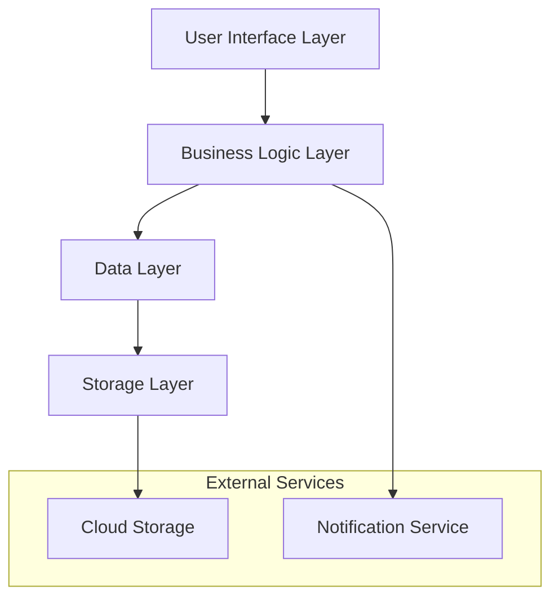

# Design Document: Recipe Manager Mobile Application

## Overview

The Recipe Manager is a cross-platform mobile application that enables users to create, manage, and share cooking recipes with integrated cooking assistance features. The application provides comprehensive recipe management, stage-specific photo documentation, social sharing capabilities, recipe modification tools, and cooking timers with notifications to guide users through recipe execution.

The system is designed as a mobile-first application with offline-first capabilities, ensuring users can access their recipes and cooking tools even without internet connectivity. The application will sync data to cloud storage when connectivity is available.

## Architecture

### High-Level Architecture

The application follows a layered architecture pattern with clear separation of concerns:



### Technology Stack

Based on current mobile development best practices and cross-platform requirements:

- **Framework**: React Native (chosen for its mature ecosystem, strong community support, and excellent performance for recipe management use cases)
- **State Management**: Redux Toolkit with RTK Query for efficient data management and caching
- **Local Storage**: SQLite with Watermelon DB for offline-first data persistence
- **Photo Management**: React Native Image Picker with local file system storage and cloud sync
- **Notifications**: React Native Push Notifications with background task scheduling
- **Cloud Storage**: Firebase Storage for photo sync and Firestore for recipe data sync
- **Navigation**: React Navigation v6 for smooth mobile navigation patterns

## Components and Interfaces

### Core Components

#### 1. Recipe Management Component
- **RecipeService**: Handles CRUD operations for recipes
- **RecipeValidator**: Validates recipe data integrity and completeness
- **RecipeSearchEngine**: Provides search functionality across recipes

#### 2. Photo Management Component
- **PhotoService**: Manages photo capture, storage, and association with recipe stages
- **PhotoOptimizer**: Handles image compression and optimization for mobile storage
- **PhotoSyncManager**: Manages cloud synchronization of photos

#### 3. Sharing Component
- **ShareService**: Handles recipe sharing across multiple platforms
- **ShareFormatter**: Formats recipe data for different sharing channels
- **RecipeCopyManager**: Manages copying shared recipes to user collections

#### 4. Timer and Notification Component
- **TimerService**: Manages multiple concurrent cooking timers
- **NotificationManager**: Handles background notifications and alerts
- **CookingSessionManager**: Coordinates timers and reminders during active cooking

#### 5. Data Synchronization Component
- **SyncManager**: Orchestrates data synchronization between local and cloud storage
- **ConflictResolver**: Handles data conflicts during synchronization
- **OfflineQueueManager**: Manages operations queued while offline

### Interface Definitions

#### Recipe Interface
```typescript
interface Recipe {
  id: string;
  title: string;
  description?: string;
  ingredients: Ingredient[];
  steps: CookingStep[];
  preparationTime: number;
  cookingTime: number;
  servings: number;
  tags: string[];
  createdAt: Date;
  updatedAt: Date;
  version: number;
  parentRecipeId?: string; // For recipe upgrades
}

interface Ingredient {
  id: string;
  name: string;
  quantity: number;
  unit: string;
  notes?: string;
  photos: Photo[];
}

interface CookingStep {
  id: string;
  stepNumber: number;
  instruction: string;
  duration?: number; // in minutes
  temperature?: number;
  photos: Photo[];
  timerRequired: boolean;
}
```

#### Photo Interface
```typescript
interface Photo {
  id: string;
  localPath: string;
  cloudUrl?: string;
  caption?: string;
  stage: PhotoStage;
  timestamp: Date;
  syncStatus: SyncStatus;
}

enum PhotoStage {
  RAW_INGREDIENTS = 'raw_ingredients',
  PROCESSED_INGREDIENTS = 'processed_ingredients',
  COOKING_STEP = 'cooking_step',
  FINAL_RESULT = 'final_result'
}

enum SyncStatus {
  LOCAL_ONLY = 'local_only',
  SYNCING = 'syncing',
  SYNCED = 'synced',
  SYNC_FAILED = 'sync_failed'
}
```

#### Timer Interface
```typescript
interface CookingTimer {
  id: string;
  recipeId: string;
  stepId: string;
  duration: number; // in seconds
  remainingTime: number;
  status: TimerStatus;
  createdAt: Date;
}

enum TimerStatus {
  READY = 'ready',
  RUNNING = 'running',
  PAUSED = 'paused',
  COMPLETED = 'completed',
  CANCELLED = 'cancelled'
}
```

## Data Models

### Database Schema

The application uses SQLite for local storage with the following key tables:

#### Recipes Table
- Primary storage for recipe metadata and content
- Supports versioning for recipe upgrades
- Includes full-text search capabilities

#### Photos Table
- Stores photo metadata and local file paths
- Links to recipes and specific stages
- Tracks cloud synchronization status

#### Collections Table
- Manages user-created recipe collections
- Supports many-to-many relationships with recipes

#### Timers Table
- Stores active and historical cooking timers
- Links to specific recipe steps

#### Sync_Queue Table
- Manages operations pending cloud synchronization
- Ensures data consistency during offline periods

### Data Flow Patterns

#### Offline-First Pattern
1. All operations execute against local SQLite database first
2. Operations are queued for cloud synchronization
3. Sync occurs automatically when connectivity is available
4. Conflict resolution handles simultaneous edits

#### Photo Management Pattern
1. Photos are captured and stored locally immediately
2. Images are optimized for mobile storage
3. Cloud upload occurs in background with retry logic
4. Local photos remain accessible during sync failures

## Error Handling

### Error Categories and Strategies

#### 1. Network Connectivity Errors
- **Strategy**: Graceful degradation with offline-first approach
- **Implementation**: Queue operations for later sync, show connectivity status
- **User Experience**: Clear indicators of offline mode, no functionality loss

#### 2. Storage Errors
- **Strategy**: Robust error recovery with user notification
- **Implementation**: Automatic retry with exponential backoff, alternative storage paths
- **User Experience**: Clear error messages with suggested actions

#### 3. Photo Processing Errors
- **Strategy**: Fallback mechanisms with user choice
- **Implementation**: Multiple image formats support, compression alternatives
- **User Experience**: Option to retry or skip photo operations

#### 4. Timer and Notification Errors
- **Strategy**: Fail-safe with manual backup options
- **Implementation**: Multiple notification channels, visual timer fallbacks
- **User Experience**: Clear timer status, manual timer controls always available

#### 5. Data Synchronization Conflicts
- **Strategy**: User-controlled conflict resolution
- **Implementation**: Present both versions with merge options
- **User Experience**: Clear conflict presentation with recommended actions

### Error Recovery Mechanisms

- **Automatic Retry**: Network operations with exponential backoff
- **Data Validation**: Input validation at multiple layers
- **Graceful Degradation**: Core functionality available during partial failures
- **User Feedback**: Clear error messages with actionable next steps
- **Logging**: Comprehensive error logging for debugging and improvement

## Testing Strategy

### Dual Testing Approach

The application will employ both unit testing and property-based testing to ensure comprehensive coverage and correctness validation.

#### Unit Testing
Unit tests will focus on:
- **Specific Examples**: Concrete test cases that demonstrate correct behavior
- **Edge Cases**: Boundary conditions, empty inputs, and error scenarios
- **Integration Points**: Component interactions and data flow validation
- **User Interface**: Component rendering and user interaction flows

#### Property-Based Testing
Property tests will verify universal properties using **fast-check** library for JavaScript/TypeScript:
- **Configuration**: Minimum 100 iterations per property test
- **Coverage**: Universal properties that hold across all valid inputs
- **Randomization**: Comprehensive input space exploration
- **Tag Format**: Each test tagged as **Feature: recipe-manager, Property {number}: {property_text}**

The combination ensures both concrete correctness validation (unit tests) and comprehensive input coverage (property tests), providing confidence in system reliability across all usage scenarios.

## Correctness Properties

*A property is a characteristic or behavior that should hold true across all valid executions of a system—essentially, a formal statement about what the system should do. Properties serve as the bridge between human-readable specifications and machine-verifiable correctness guarantees.*

The following properties define the correctness requirements for the Recipe Manager application. Each property represents a universal rule that must hold across all valid inputs and system states.

### Property 1: Recipe Creation Completeness
*For any* valid recipe data containing title, ingredients, and cooking steps, creating and then retrieving the recipe should return all provided data with proper validation
**Validates: Requirements 1.1, 1.4**

### Property 2: Recipe Update Preservation
*For any* existing recipe, updating any field should preserve the original creation date while correctly updating all modified fields
**Validates: Requirements 1.2**

### Property 3: Recipe Deletion Consistency
*For any* recipe in the system, deleting it should make it completely inaccessible through all retrieval methods
**Validates: Requirements 1.3**

### Property 4: Search Result Relevance
*For any* search query and recipe collection, all returned results should contain the search term in title, ingredients, or tags
**Validates: Requirements 1.5**

### Property 5: Photo-Stage Association Integrity
*For any* photo and recipe stage, associating the photo with the stage should make it retrievable when viewing that specific stage
**Validates: Requirements 2.1, 2.2**

### Property 6: Photo Processing Consistency
*For any* captured photo, the system should automatically optimize it while preserving visual content and associating it with the correct stage
**Validates: Requirements 2.5, 2.6**

### Property 7: Recipe Sharing Completeness
*For any* recipe with associated photos and notes, sharing should transfer all recipe data, photos, and metadata to the recipient
**Validates: Requirements 3.1, 3.3**

### Property 8: Shared Recipe Independence
*For any* shared recipe, modifications made by the recipient should not affect the original recipe owned by the sender
**Validates: Requirements 3.5**

### Property 9: Recipe Version Linking
*For any* recipe upgrade, the system should maintain a traceable link to the parent recipe while treating the upgrade as an independent entity
**Validates: Requirements 4.1, 4.4**

### Property 10: Version History Round-Trip
*For any* recipe with multiple versions, reverting to a previous version and then viewing it should restore the exact state of that historical version
**Validates: Requirements 4.5**

### Property 11: Timer Creation Completeness
*For any* recipe with timed cooking steps, starting a cooking session should create active timers for all steps that specify duration
**Validates: Requirements 5.1**

### Property 12: Timer Notification Reliability
*For any* active timer, when the countdown reaches zero, the system should trigger a notification regardless of app state
**Validates: Requirements 5.2, 5.3**

### Property 13: Multi-Timer State Management
*For any* number of active timers, the system should accurately track and display the remaining time for each timer independently
**Validates: Requirements 5.5**

### Property 14: Collection-Recipe Relationship Integrity
*For any* recipe added to a collection, it should remain accessible through both the main library and the collection, and removing it from the collection should not affect main library access
**Validates: Requirements 6.2, 6.3**

### Property 15: Multi-Collection Membership
*For any* recipe, it should be possible to add it to multiple collections simultaneously without data duplication or conflicts
**Validates: Requirements 6.4**

### Property 16: Navigation State Preservation
*For any* user action sequence, navigating away from and returning to a screen should restore the previous state and progress
**Validates: Requirements 7.5**

### Property 17: Data Persistence Round-Trip
*For any* user data modification, closing and reopening the application should restore all data in the exact state it was when the app was closed
**Validates: Requirements 8.1, 8.2**

### Property 18: Cloud Sync Consistency
*For any* local data changes, when network connectivity is available, the cloud storage should eventually contain the same data as local storage
**Validates: Requirements 8.3**

### Property 19: Offline Functionality Completeness
*For any* locally stored recipe and photo, all viewing, editing, and cooking assistance features should remain fully functional without network connectivity
**Validates: Requirements 8.5**